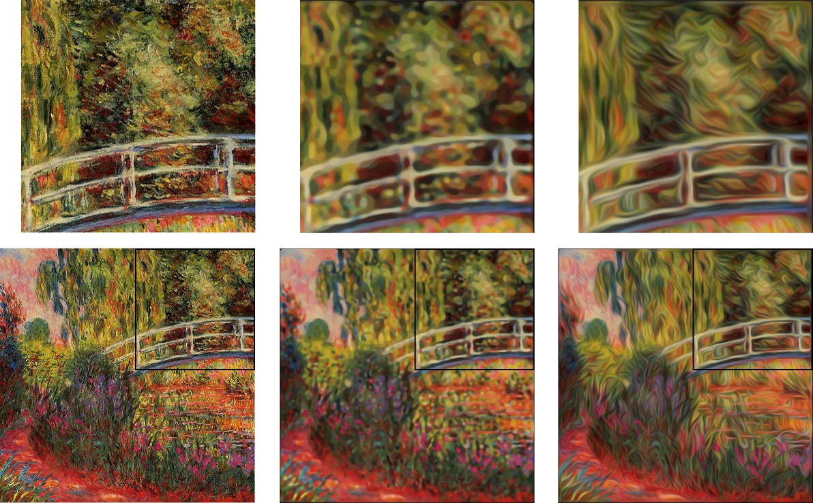

# Toolbox for nonlinear, anisotropic diffusion on the GPU

Fast and fully vectorized MATLAB implementation of non-linear, anisotropic diffusion with gpuarray and RGB image support. Implemented diffusion types are edge enhancing and coherence enhancing diffusion (Weickert, 1999) as well as Perona-Malik non-linear isotropic diffusion with different diffusivities. 



## Download

Download the repository via
```
$ git clone https://github.com/phflot/diffusion_toolbox.git
```

## Documentation and Usage

The file ```demo.m``` demonstrates the usage of the functions. 